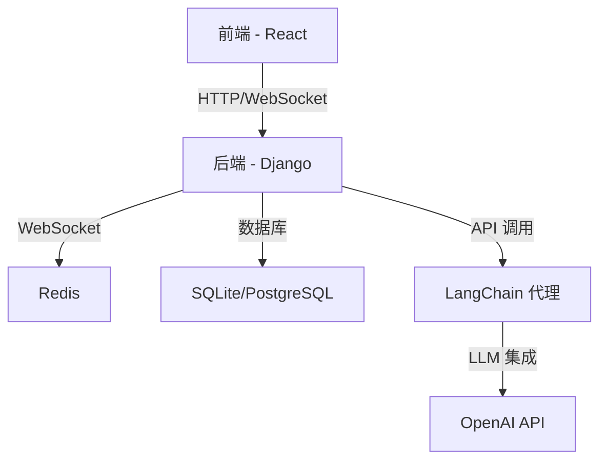

# LLM 驱动的聊天应用

一个全栈聊天应用，包含 Django 后端、React 前端和基于 LangChain 的 AI 代理。本项目支持实时聊天功能、多代理系统、消息持久化和 AI 驱动的响应。

## 主要特性 ✨
- 使用 WebSockets 的**实时消息传递**
- 基于 LangChain 的**多 AI 代理**系统
- 使用 Django 模型的**消息持久化**
- 可定制不同个性和能力的**代理系统**
- 实时用户体验的**输入指示器**
- 开发用的**调试工具**
- 基于 React 和 TypeScript 的**响应式 UI**
- 基于 Redis 的**可扩展消息代理**

## 架构概览 🏗️


## 技术栈 💻
### 后端 (Django)
- **框架**: Django 4.x
- **ASGI 服务器**: Daphne
- **数据库**: SQLite (开发环境), PostgreSQL (生产环境)
- **缓存/消息代理**: Redis
- **API**: Django REST Framework
- **WebSockets**: Django Channels
- **AI 集成**: LangChain, OpenAI

### 前端 (React)
- **框架**: React 18
- **语言**: TypeScript
- **样式**: CSS Modules
- **状态管理**: React Context API
- **WebSocket**: WebSocket API

## 安装与设置 🛠️

### 先决条件
- Python 3.9+
- Node.js 16+
- Redis
- OpenAI API 密钥

### 1. 克隆仓库
```bash
git clone https://github.com/virattt/chat_app.git
cd chat_app
```

### 2. 后端设置
```bash
cd backend

# 创建并激活虚拟环境
python -m venv venv
source venv/bin/activate  # Linux/macOS
venv\Scripts\activate     # Windows

# 安装依赖
pip install -r requirements.txt

# 设置环境变量
cp .env.example .env
# 在 .env 文件中填入您的 OpenAI API 密钥和其他设置
```

### 3. 前端设置
```bash
cd ../frontend

# 安装依赖
npm install

# 配置环境（如果需要）
cp .env.example .env
```

## 配置 ⚙️

### 后端环境变量 (backend/.env)
```ini
OPENAI_API_KEY=your_api_key_here
DEBUG=True
SECRET_KEY=your_secret_key
ALLOWED_HOSTS=localhost,127.0.0.1
DATABASE_URL=sqlite:///db.sqlite3
REDIS_URL=redis://localhost:6379
```

### 前端配置 (frontend/src/config.ts)
```typescript
export const config = {
  apiBaseUrl: 'http://localhost:8000',
  wsBaseUrl: 'ws://localhost:8000',
  // ... 其他设置
};
```

## 运行应用 🚀

### 启动 Redis
```bash
redis-server
```

### 启动后端 (在 backend 目录)
```bash
daphne project.asgi:application
```

### 启动前端 (在 frontend 目录)
```bash
npm start
```

应用将在 http://localhost:3000 可用

## 项目结构 📂

### 后端
```
backend/
├── chat/               # 聊天应用核心
│   ├── agents/         # LangChain 代理实现
│   ├── messages/       # 消息处理与持久化
│   ├── migrations/     # 数据库迁移
│   ├── api_urls.py     # REST API 端点
│   ├── consumers.py    # WebSocket 处理器
│   ├── models.py       # 数据库模型
│   ├── serializers.py  # API 序列化器
│   └── views.py        # REST API 视图
└── project/            # Django 项目配置
    ├── settings.py     # 项目设置
    ├── urls.py         # 主 URL 路由
    └── asgi.py         # ASGI 应用
```

### 前端
```
frontend/
├── src/
│   ├── components/     # React 组件
│   │   └── chat/       # 聊天 UI 组件
│   ├── data/           # 数据模型
│   ├── types/          # TypeScript 类型定义
│   ├── utils/          # 工具函数
│   ├── App.tsx         # 主应用组件
│   └── index.tsx       # 入口文件
└── public/             # 静态资源
```

## API 文档 📚

### REST API 端点
- `GET /api/messages/` - 获取消息历史
- `POST /api/messages/` - 创建新消息
- `GET /api/agents/` - 列出可用代理

### WebSocket 端点
- `ws://localhost:8000/ws/chat/` - 实时聊天端点

## 部署 🚢

生产环境部署：
1. 在 backend/.env 中设置 `DEBUG=False`
2. 使用 PostgreSQL 替代 SQLite
3. 配置生产级 ASGI 服务器（如 Uvicorn + Nginx）
4. 构建前端生产版本：
   ```bash
   cd frontend
   npm run build
   ```

## 故障排除 ⚠️

### 常见问题
1. **WebSocket 连接失败**
   - 确保 Redis 正在运行
   - 验证 Daphne 是否在正确端口运行（默认：8000）
   - 检查 `backend/project/settings.py` 中的 CORS 设置

2. **AI 代理无响应**
   - 验证 backend/.env 中的 OpenAI API 密钥
   - 检查 `backend/chat/agents/` 中的 LangChain 代理配置

3. **数据库问题**
   - 运行迁移：`python manage.py migrate`
   - 创建超级用户：`python manage.py createsuperuser`

## 贡献指南 🤝

欢迎贡献！请遵循以下步骤：
1. Fork 本仓库
2. 创建新分支 (`git checkout -b feature/your-feature`)
3. 提交更改 (`git commit -am '添加新功能'`)
4. 推送到分支 (`git push origin feature/your-feature`)
5. 创建 Pull Request

## 许可证 📄
本项目采用 MIT 许可证 - 详见 [LICENSE](LICENSE) 文件

